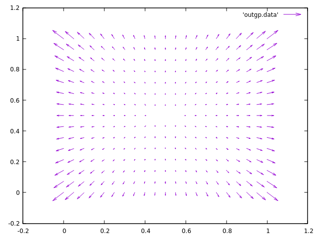
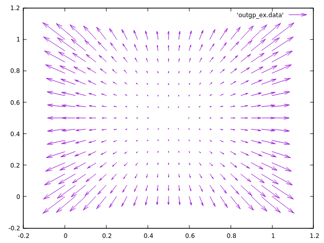

# LDPK - The Lens Distortion Plugin Kit 

Stripped down version,WIP for testing purpose in linux.

### Modifications:

- verbose readme
- csh script converted to bash
- added result of examples
- added empty lib, tmp required for everything to build smoothly
- added example for radial deg 8
- build notes

### notes

in the script/makeall.linux.sh script, `ar` is to create an archive, see:
https://www.lifewire.com/ar-linux-command-4093866

Documentation:
generated by Doxygen:
./doc/doxy/html/index.html

### quick start

OS: Linux (debian based)
compiler: g++ 9.3.0
See additional details in doc/tex/...pdf

    $ cd scripts
    $ ./makeall.linux.sh
    $ cd ..
    $ bin/./test_model_visualizer lib/tde4_ldp_radial_deg_8.so test/para_radial_deg_8.data tmp/outgp.data
    $ gnuplot
    gnuplot> plot 'outgp.data' with vector

**Other example**:

    $ g++ -O2 -fPIC -shared -DLDPK_COMPILE_AS_PLUGIN_SDV -I/home/ludovic/Programs/ComputerGraphics/LDPK_LensDistortionPacKage/LDPK/script/../include tde4_ldp_example_radial_deg_8.C  -o ../../lib/tde4_ldp_example_radial_deg_8.so
     $ bin/./test_model_visualizer lib/tde4_ldp_example_radial_deg_8.so test/para_example_radial_deg_8.data tmp/outgp_ex.data

    $ bin/./test_model_visualizer lib/tde4_ldp_radial_decentered_deg_4_cylindric.so test/para_radial_decentered_deg_4.data tmp/outpg_rad_dec_deg4.data

## Original readme:

In order to compile C++ shared libraries please run script/makeall.csh
In order to compile python bindings please modify script/make_python_bindings.csh
according to your needs and run it.

Doxygen documents start at doc/doxy/html/index.html

White paper: doc/tex/...pdf

Send questions and comments to uwe@sci-d-vis.com

Thanks and good luck!

